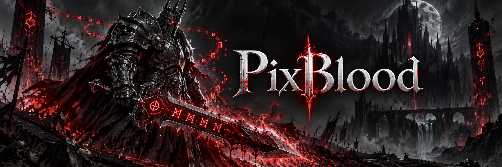

<p align="center">
  
</p>

<h1 align="center">PixBlood</h1>

<p align="center"><strong>鲜血死亡骑士 · 像素读取 · 自动循环</strong></p>
<p align="center">Lua 显示战斗状态，Python 读取像素，按优先级执行技能。</p>

<p align="center">
  
  
  
  <a href="LICENSE"></a>
</p>

<p align="center">
  <a href="#快速开始">快速开始</a> ·
  <a href="#配置与控制">配置与控制</a> ·
  <a href="#工作原理">工作原理</a> ·
  <a href="#开发与修改">开发与修改</a> ·
  <a href="#常见问题">常见问题</a>
</p>

## 项目简介

PixBlood 是运行在 Windows 上的《魔兽世界》鲜血死亡骑士像素循环工具，由游戏内 Lua 插件和 Python 桌面程序组成。插件将生命值、符文、符能、冷却和目标状态等信息显示为色块、进度条与图标；桌面程序截图解码后，执行手写循环并向游戏窗口发送按键。

- **专注血 DK**：围绕死亡使者鲜血死亡骑士编写一套优先级循环，包含自疗、白骨之盾维护、打断和输出技能。
- **目标与焦点协同**：部分攻击技能按射程检查目标与焦点，优先选择目标；打断支持焦点和目标。
- **按需控制**：游戏内启停、爆发计时、独立爆发药水开关，以及可编辑的打断黑名单。
- **运行状态可见**：桌面端分别控制截图和循环，显示定位状态、动作与错误日志。
- **便于修改**：像素协议、状态对象、循环决策和按键执行各自独立，规则集中在一个 Python 文件中。

## 快速开始

### 1. 准备环境

| 项目 | 要求 |
| --- | --- |
| 操作系统 | Windows，截图和按键驱动使用 Windows API |
| Python | 3.13，使用 uv 管理环境与依赖 |
| 游戏 | 《魔兽世界》正式服，鲜血死亡骑士 |
| 客户端语言 | 当前技能宏使用简体中文名称 |
| 插件版本 | 当前 TOC 声明 Interface `120100`、版本 `12.1.0.68209`；这是仓库声明的版本，不代表其他版本已验证 |

先安装 Git 和 uv，然后在 PowerShell 中运行：

```powershell
git clone https://github.com/liantian-cn/PixBlood.git
cd PixBlood
uv sync --python 3.13
```

### 2. 安装游戏插件

将仓库中 `pix/lua/` 的**全部内容**复制到游戏目录下：

```text
World of Warcraft/
└── _retail_/
    └── Interface/
        └── AddOns/
            └── PixBlood/
                ├── PixBlood.toc
                ├── macro.lua
                ├── core/
                ├── cells/
                └── ui/
```

确认 `PixBlood.toc` 直接位于 `AddOns/PixBlood/` 下，启用插件并在游戏内执行 `/reload`。桌面端的“拷贝插件”按钮目前是占位功能，请手动复制。

插件加载时会自动绑定技能组合键，并调整部分游戏 CVar，包括 UI 缩放、抗锯齿、亮度、对比度和镜头设置。具体设置见 [core/base.lua](pix/lua/core/base.lua)，键位见 [macro.lua](pix/lua/macro.lua)。

### 3. 启动桌面程序

```powershell
uv run python -m pix.main
```

1. 进入游戏，保持插件像素区域在桌面上可见、不被遮挡。
2. 点击桌面程序的 **启动截图**，查看定位状态。
3. 确认游戏内插件处于 **已启动** 状态，再点击桌面程序的 **启动循环**。
4. 进入战斗并选择可攻击目标，循环按当前状态执行技能。

点击 **停止循环** 可以保留截图观察；点击 **停止截图** 会先停止循环。重新启动截图后，需要手动再次启动循环。

## 配置与控制

### 桌面端

| 设置 | 默认值 | 范围 / 行为 |
| --- | --- | --- |
| 截图 FPS | 25 | 15–35 |
| Action 基础 FPS | 10 | 8–16；普通循环间隔在基础间隔的 ±50% 范围内随机浮动 |
| 游戏进程 | 自动发现 | 选择第一个 `wow.exe`，进程退出后重新查找 |
| 配置保存 | 当前运行期间 | 重启桌面程序后恢复默认值 |

### 游戏内

插件控制面板提供启停按钮和“配置”入口。**爆发药水**默认关闭，独立控制圣光潜力的使用，不与爆发计时联动。**打断黑名单**按法术 ID 配置，按 ID 升序取前 15 项参与图标匹配。

这些配置通过 WoW 的 `PixBloodDB` 保存；插件启停、爆发与延迟计时属于运行时状态。

| 命令 | 作用 |
| --- | --- |
| `/blood toggle` | 切换插件启停状态 |
| `/blood disable` | 关闭插件，循环返回空闲动作 |
| `/blood burst` | 开启 15 秒爆发窗口 |
| `/blood burst 30` | 设置 30 秒爆发窗口 |
| `/blood burst 0` | 结束爆发窗口 |
| `/blood delay 0.4` | 设置插件延迟状态；当前 Python 循环未使用该状态暂停动作 |

插件加载时默认启用，并初始化 60 秒爆发窗口。`burst` 命令设置的是循环可读取的状态，具体技能是否使用仍取决于循环条件。

<details>
<summary><strong>展开查看完整键位</strong></summary>

插件通过安全按钮绑定宏，无需逐个手工创建宏。当前包含 17 个循环键位，以及独立的重载界面键位。

| 组合键 | 动作 |
| --- | --- |
| 右 Ctrl + 小键盘 1 | 目标灵界打击 |
| 右 Ctrl + 小键盘 2 | 焦点心灵冰冻 |
| 右 Ctrl + 小键盘 3 | 目标心灵冰冻 |
| 右 Ctrl + 小键盘 4 | 目标死神印记 |
| 右 Ctrl + 小键盘 5 | 符文刃舞 |
| 右 Ctrl + 小键盘 6 | 目标精髓分裂 |
| 右 Ctrl + 小键盘 7 | 目标死神的抚摩 |
| 右 Ctrl + 小键盘 8 | 圣光潜力 |
| 右 Ctrl + 小键盘 9 | 血液沸腾 |
| 右 Ctrl + 小键盘 0 | 玩家脚下枯萎凋零 |
| 右 Shift + 小键盘 1 | 目标心脏打击 |
| 右 Shift + 小键盘 2 | 亡者复生 |
| 右 Shift + 小键盘 3 | 焦点灵界打击 |
| 右 Shift + 小键盘 4 | 焦点死神印记 |
| 右 Shift + 小键盘 5 | 焦点精髓分裂 |
| 右 Shift + 小键盘 6 | 焦点心脏打击 |
| 右 Shift + 小键盘 7 | 焦点死神的抚摩 |
| Ctrl + F12 | `/reload` |

修改键位时，同步更新 `Rotation.keymap` 和 `pix/lua/macro.lua`，并留意与其他游戏绑定的冲突。

</details>

## 工作原理


截图线程发布最新帧，Action 线程顺序完成解码、决策和执行。循环按规则顺序首次命中返回一个动作；没有满足条件的规则时返回 `Idle`。截图失败或帧龄超过 0.5 秒时，不执行该帧对应的按键动作。

当前解码器匹配 Lua 正式模式的 **4 px Cell、12 px 高基板**。像素位置和字段含义见 [layout.md](layout.md)，请保持插件与 Python 代码来自同一版本。

## 开发与修改

| 模块 | 职责 |
| --- | --- |
| [pix/lua/](pix/lua/) | 游戏内状态显示、控制面板与技能宏 |
| [pix/capture.py](pix/capture.py) | GDI 截图、像素区域定位与截图线程 |
| [pix/matrix.py](pix/matrix.py) | 色块、进度条和图标解码 |
| [pix/context.py](pix/context.py) | 将解码结果转换为循环使用的状态属性 |
| [pix/rotation.py](pix/rotation.py) | 唯一的手写循环与键位映射 |
| [pix/action.py](pix/action.py) | 动作类型与顺序执行线程 |
| [pix/keyboard.py](pix/keyboard.py) | 向指定游戏进程窗口发送按键消息 |
| [pix/ui.py](pix/ui.py) | PySide6 界面、进程发现与线程生命周期 |
| [pix/main.py](pix/main.py) | 应用入口 |

修改循环时，从 `Rotation.main_rotation(ctx)` 入手。返回值为 `Cast(name, note=None)`、`Use(name, note=None)`、`Idle(reason)` 或 `Sleep(reason, seconds=1)`；`Cast` 和 `Use` 的名称必须存在于 `keymap` 中。需要等待时返回 `Sleep`，实际等待时间限制为 1–15 秒，避免在循环函数中阻塞线程。

每次启动循环都会创建一个 `Rotation` 实例。运行错误或游戏进程重开不会重建该实例；修改代码后请重启桌面程序。修改像素布局时，同步更新 Lua 显示端、Python 解码端和 `layout.md`，并保留 TOC 的加载顺序。

### 本地检查

```powershell
uv run pyright pix
uv run python -m compileall pix
git diff --check
```

仓库目前没有自动化测试框架。Lua 显示、布局和状态切换需要在游戏内 `/reload` 后验证。

## 常见问题

**截图定位失败？**

确认插件已经加载、像素区域完整可见，且 `pix/lua/core/base.lua` 中 `debug = false`。调试模式会放大像素区域，不符合当前解码器的尺寸要求。可以先运行一次只截图、不发送按键的诊断：

```powershell
uv run python -m pix.test_captura
```

诊断会输出定位坐标和区域宽高，或具体失败原因。

**截图正常，但循环没有动作？**

确认已单独点击“启动循环”，游戏内插件已启用，角色处于战斗并选中了存活、可攻击的目标。查看日志中的 `Idle` 原因；正在施法、引导、蓄力或没有满足技能条件时，循环会等待。

**有动作日志，但技能没有施放？**

检查游戏进程、客户端语言和宏绑定是否匹配。技能还受射程、资源与冷却限制；动作日志表示程序选择了该动作，不表示游戏已确认施法成功。

**能否用于其他职业、怀旧服或非中文客户端？**

当前实现只围绕正式服鲜血死亡骑士的一套循环维护。其他职业和版本没有适配；非中文客户端需要调整宏中的技能名称。

## 许可证

本项目采用 [GNU General Public License v3.0](LICENSE)。
